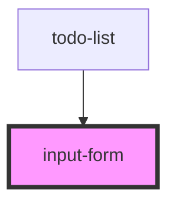

# input-form

<!-- Auto Generated Below -->

## Events

| Event       | Description | Type                  |
| ----------- | ----------- | --------------------- |
| `todoAdded` |             | `CustomEvent<string>` |

## Dependencies

### Used by

 - [todo-list](../todo-list)

### Graph

----------------------------------------------

*Built with [StencilJS](https://stenciljs.com/)*
