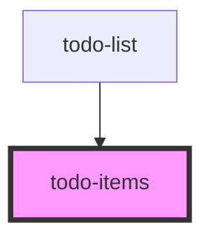

# todo-items

<!-- Auto Generated Below -->

## Properties

| Property     | Attribute | Description | Type                                          | Default     |
| ------------ | --------- | ----------- | --------------------------------------------- | ----------- |
| `index`      | `index`   |             | `number`                                      | `undefined` |
| `onComplete` | --        |             | `(index: number, completed: boolean) => void` | `undefined` |
| `onDelete`   | --        |             | `(index: number) => void`                     | `undefined` |
| `todo`       | --        |             | `Todo`                                        | `undefined` |

## Dependencies

### Used by

 - [todo-list](../todo-list)

### Graph

----------------------------------------------

*Built with [StencilJS](https://stenciljs.com/)*
